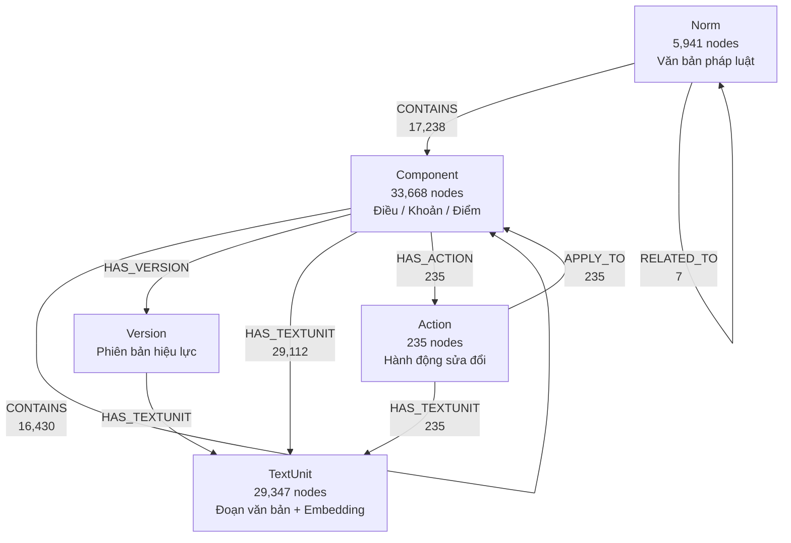
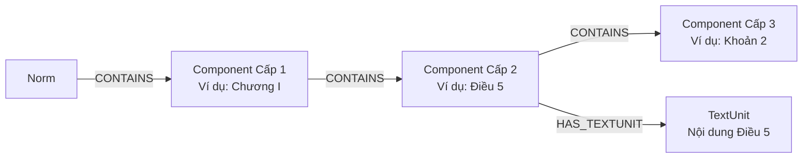
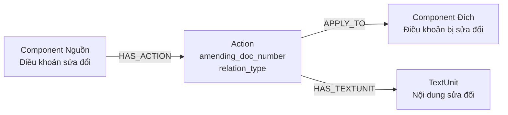
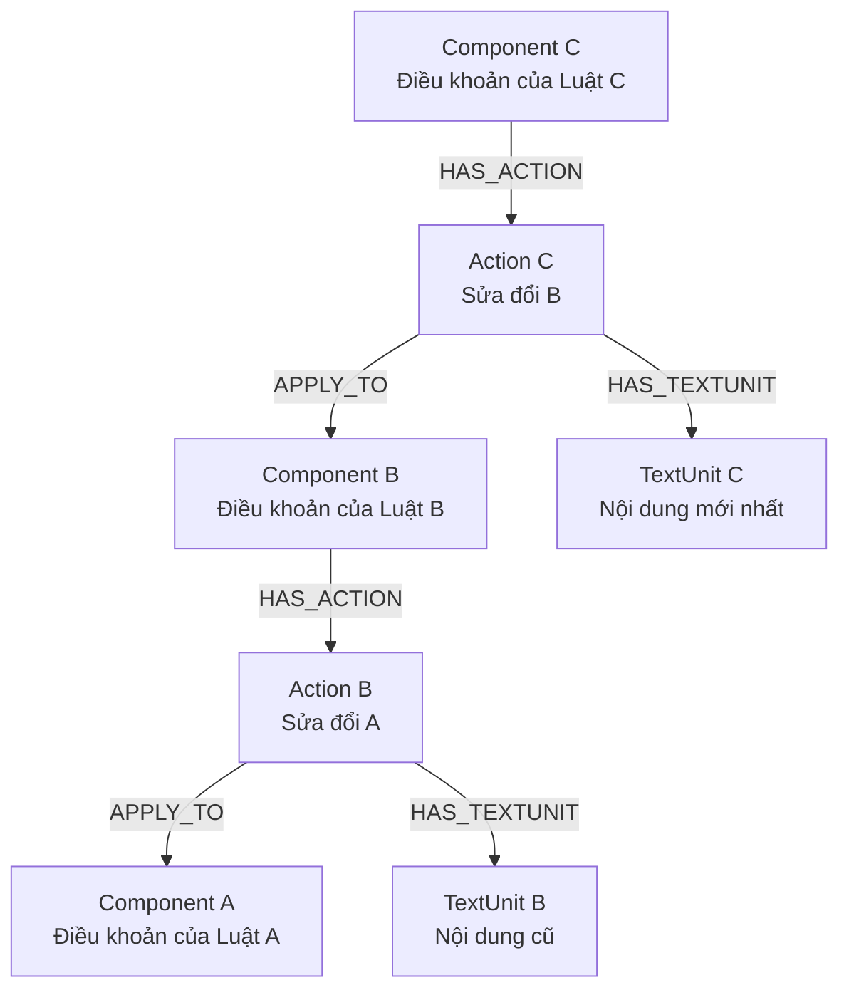

# Chức năng: Tài liệu kiến trúc Neo4j GraphRAG và cơ chế duyệt đệ quy chuỗi sửa đổi điều khoản pháp lý.

# Kiến trúc Neo4j GraphRAG & Cơ chế Duyệt Đệ quy Chuỗi Sửa đổi

Tài liệu này mô tả đầy đủ kiến trúc đồ thị tri thức pháp lý trên Neo4j (bao gồm Nodes, Relationships, Properties và Indexes) và cơ chế duyệt đệ quy chuỗi sửa đổi bắc cầu giữa các điều khoản.

---

## 1. Tổng quan Kiến trúc Đồ thị (Neo4j Schema)

### 1.1. Sơ đồ Tổng quan Nodes & Relationships



### 1.2. Chi tiết Thuộc tính (Properties) của từng Node

#### Norm (Văn bản pháp luật)
| Thuộc tính | Mô tả |
|---|---|
| `norm_id` | ID nội bộ |
| `norm_number` | Số hiệu văn bản (VD: `83/2014/NĐ-CP`) |
| `norm_type` | Loại văn bản (Luật, Nghị định, Thông tư...) |
| `title` | Tiêu đề đầy đủ |
| `validity_status` | Trạng thái hiệu lực |
| `published_date` | Ngày ban hành |
| `valid_from` | Ngày có hiệu lực |
| `signer` | Người ký |
| `publisher` | Cơ quan ban hành |
| `updated_at` | Thời gian cập nhật |

#### Component (Điều / Khoản / Điểm)
| Thuộc tính | Mô tả |
|---|---|
| `comp_id` | ID duy nhất (VD: `127429__c59`) |
| `norm_id` | ID văn bản mẹ chứa Component này |
| `citation` | Trích dẫn (VD: `Điều 17`, `Khoản 3`) |
| `level` | Cấp bậc (`dieu`, `khoan`, `diem`) |
| `title_text` | Tiêu đề / nội dung ngắn |
| `order_index` | Thứ tự sắp xếp trong văn bản |
| `updated_at` | Thời gian cập nhật |

#### TextUnit (Đoạn văn bản + Vector Embedding)
| Thuộc tính | Mô tả |
|---|---|
| `unit_id` | ID duy nhất |
| `accumulated_text` | Nội dung văn bản đầy đủ |
| `embedding` | Vector embedding (dùng cho semantic search) |
| `language` | Ngôn ngữ |
| `type` | Loại đoạn văn bản |
| `embedded_at` | Thời gian sinh embedding |
| `updated_at` | Thời gian cập nhật |

#### Action (Hành động sửa đổi pháp lý)
| Thuộc tính | Mô tả |
|---|---|
| `action_id` | ID duy nhất |
| `amending_doc_number` | Số hiệu văn bản sửa đổi (VD: `83/2014/NĐ-CP`) |
| `relation_type` | Loại hành động (`SUPPLEMENTS`, `PARTIALLY_TERMINATES`...) |
| `updated_at` | Thời gian cập nhật |

#### Version (Phiên bản hiệu lực của Điều khoản)
| Thuộc tính | Mô tả |
|---|---|
| `version_id` | ID phiên bản |

> **Lưu ý:** Node Version hiện có rất ít dữ liệu trong DB. Các truy vấn liên quan đến Version sử dụng cơ chế fallback: ưu tiên tìm qua Version trước, nếu không có thì lấy trực tiếp từ Component.

### 1.3. Indexes đã cấu hình

| Tên Index | Loại | Label | Properties |
|---|---|---|---|
| `textunit_embedding_index` | **VECTOR** | TextUnit | `embedding` |
| `component_title_fulltext` | FULLTEXT | Component | `title_text`, `citation` |
| `norm_title_fulltext` | FULLTEXT | Norm | `title` |
| `textunit_acc_text_fulltext` | FULLTEXT | TextUnit | `accumulated_text` |
| `comp_id` | RANGE | Component | `comp_id` |
| `norm_id` | RANGE | Norm | `norm_id` |
| `unit_id` | RANGE | TextUnit | `unit_id` |
| `action_id` | RANGE | Action | `action_id` |
| `norm_status` | RANGE | Norm | `validity_status` |
| `comp_level` | RANGE | Component | `level` |

---

## 2. Mối quan hệ giữa các Node (Chi tiết)

### 2.1. Quan hệ Cấu trúc Nội dung (Norm → Component → TextUnit)



* **`Norm -[:CONTAINS]-> Component`**: Văn bản chứa các điều khoản cấp 1.
* **`Component -[:CONTAINS]-> Component`**: Điều khoản cha chứa điều khoản con (phân cấp `Chương > Mục > Điều > Khoản > Điểm`).
* **`Component -[:HAS_TEXTUNIT]-> TextUnit`**: Liên kết đến nội dung văn bản đầy đủ kèm vector embedding.

### 2.2. Quan hệ giữa các Văn bản (Norm ↔ Norm)

| Quan hệ | Số lượng | Ý nghĩa |
|---|---|---|
| `CITES` | 3,402 | Văn bản A trích dẫn/viện dẫn văn bản B |
| `REFERS_TO` | 611 | Văn bản A tham chiếu đến văn bản B |
| `IMPLEMENTS` | 481 | Văn bản A hướng dẫn thi hành văn bản B |
| `SUPPLEMENTS` | 313 | Văn bản A bổ sung nội dung cho văn bản B |
| `AMENDS` | 183 | Văn bản A sửa đổi văn bản B |
| `PARTIALLY_TERMINATES` | 170 | Văn bản A bãi bỏ một phần văn bản B |
| `TERMINATES` | 19 | Văn bản A bãi bỏ hoàn toàn văn bản B |
| `RELATED_TO` | 7 | Liên quan chung |

### 2.3. Quan hệ Hành động Sửa đổi (Component → Action → Component)

Đây là quan hệ cốt lõi cho bài toán duyệt đệ quy chuỗi sửa đổi:



* **`HAS_ACTION` (Component nguồn → Action):** Điều khoản nào trong văn bản sửa đổi chứa hành động pháp lý này.
* **`APPLY_TO` (Action → Component đích):** Điều khoản cũ nào bị tác động bởi hành động này.
* **`HAS_TEXTUNIT` (Action → TextUnit):** Nội dung chi tiết của hành động sửa đổi.

---

## 3. Chuỗi Sửa đổi Bắc cầu (Recursive Modification Chain)

Khi có chuỗi sửa đổi nối tiếp: **Điều khoản A** bị sửa đổi bởi **Điều khoản B**, sau đó **Điều khoản B** lại bị sửa đổi bởi **Điều khoản C**:



### Cách thức hoạt động:
* Nếu Luật C sửa đổi một phần khác của Luật B không liên quan đến phần sửa Luật A → mối liên kết sẽ đi sang nhánh `Component` khác. **Điều khoản A không bị ảnh hưởng.**
* Nếu Luật C sửa đổi đúng phần sửa đổi của Luật B đối với Luật A → hệ thống duyệt đệ quy ngược từ `CompA` để tìm `Action C` ở đầu chuỗi.

---

## 4. Câu lệnh Cypher cho Duyệt Đệ quy

```cypher
MATCH path = (a:Action)-[:APPLY_TO|HAS_ACTION*1..6]->(c:Component {comp_id: $comp_id})
OPTIONAL MATCH (a)-[:HAS_TEXTUNIT]->(t:TextUnit)
RETURN a.amending_doc_number AS amending_doc, 
       a.relation_type AS action_type, 
       t.accumulated_text AS action_text,
       t.unit_id AS unit_id,
       length(path) AS depth
ORDER BY depth ASC
```

### Ý nghĩa các trường:
* `depth = 1`: Sửa đổi trực tiếp (VD: bởi Luật B).
* `depth = 3`: Sửa đổi gián tiếp bắc cầu (VD: bởi Luật C sửa Luật B).
* `ORDER BY depth ASC`: Sắp xếp từ cũ đến mới.

---

## 5. Ví dụ Thực tế trong CSDL

Tra cứu Component `'127429__c59'` (Điều 17):

1. **depth = 1:** Bãi bỏ một phần bởi Nghị định `83/2014/NĐ-CP`.
2. **depth = 3:** Phần sửa đổi tiếp tục bị bãi bỏ một phần bởi Nghị định `118/2011/NĐ-CP`.

---

## 6. Lưu ý quan trọng

* **Node `Version` có rất ít dữ liệu** trong CSDL hiện tại. Các truy vấn liên quan đến Version sử dụng cơ chế **fallback**: ưu tiên truy vấn qua `Version` trước, nếu không có kết quả thì lấy trực tiếp từ `Component`.
* Khi truy vấn thuộc tính nội dung văn bản, **luôn dùng `accumulated_text`** (không dùng `text` — thuộc tính `text` không tồn tại trên `TextUnit`).
* Khi truy vấn số hiệu văn bản, **luôn dùng `norm_number`** trên node `Norm` (không dùng `code`).
